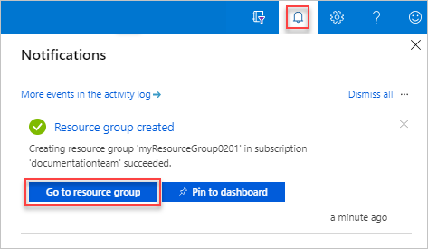
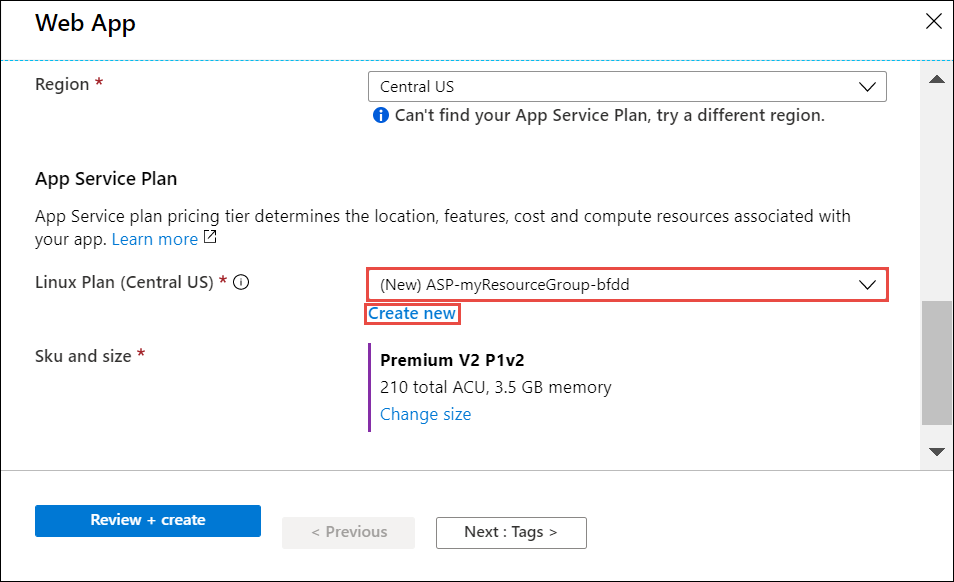

[Return to Agenda](README.md)
 

## Workshop: DevOps with GitHub on Azure

### Exercise 3 - Set up Azure for this workshop
 - Create a resource group
 - Create a staging server
 - Create a production server
 - Create a deployment slot on the production server 
 - Set the deployment slot to 50% traffic
DevOps Introduction

### Create a resource group using the Azure portal

> For this workshop we are using the [Azure portal](https://portal.azure.com) with [Azure Resource Manager](overview.md) to manage your Azure resource groups. For managing Azure resources, see [Manage Azure resources by using the Azure portal](manage-resources-portal.md).

Other articles about managing resource groups:

- [Manage Azure resource groups by using Azure CLI](manage-resources-cli.md)
- [Manage Azure resource groups by using Azure PowerShell](manage-resources-powershell.md)

> A resource group is a container that holds related resources for an Azure solution. The resource group can include all the resources for the solution, or only those resources that you want to manage as a group. You decide how you want to allocate resources to resource groups based on what makes the most sense for your organization. Generally, add resources that share the same lifecycle to the same resource group so you can easily deploy, update, and delete them as a group. The resource group stores metadata about the resources. Therefore, when you specify a location for the resource group, you are specifying where that metadata is stored. For compliance reasons, you may need to ensure that your data is stored in a particular region.

1. Sign in to the [Azure portal](https://portal.azure.com).
2. Select **Resource groups**

    
3. Select **Add**.
4. Enter the following values:

   - **Subscription**: Select your Azure subscription. 
   - **Resource group**: Enter a new resource group name. 
   - **Region**: Select an Azure location, such as **Central US**.
   

> [!NOTE]
   > You should use the same resource group and location  for all the resources we are creating today

5. Select **Review + Create**
6. Select **Create**. It takes a few seconds to create a resource group.

7. Select **Refresh** from the top menu to refresh the resource group list, and then select the newly created resource group to open it. Or select **Notification**(the bell icon) from the top, and then select **Go to resource group** to open the newly created resource group

    

### Create a Staginng Azure Web app 

1. In the [Azure portal](https://portal.azure.com), select **Create a resource**.

    

1. Select **New** > **Web App**.

   

2. Configure the **Instance Details** section before configuring the App Service plan. Choose Windows and .NET core 3.1. Include the word **Staging** in this Web App name.  This will be our **Staging** Web App Server.  

> [!NOTE]
   > You should use the same resource group and location  for all the resources we are creating today

   
3. In the **App Service Plan** section, select **Create new**.

   

4. When creating a plan, you can select the pricing tier of the new plan. In **Sku and size**, the default **S1**. 

### Create a Production Azure Web app 

5. Repeat the steps to create the **Production** server, with the following changes:

- In the **App Service Plan** section, use the same app service plan that you used for the staging server, instead of creating a new one.
- Include the word **Production** in this Web App name.  
- Use the same location and resource group.  
- 

## Add a deployment slot to the production server

>Deployment slots are live apps with their own host names. App content and configurations elements can be swapped between two deployment slots, including the production slot. 

1. In the left pane, select **Deployment slots** > **Add Slot**.
   
    
   
   > [!NOTE]
   > If the app isn't already in the **Standard**, **Premium**, or **Isolated** tier, you receive a message that indicates the supported tiers for enabling staged publishing. At this point, you have the option to select **Upgrade** and go to the **Scale** tab of your app before continuing.
   > 

1. In the **Add a slot** dialog box, give the slot the name "Canary", and select whether to clone an app configuration from another deployment slot. Select **Add** to continue.
   
    
   
    1. After the slot is added, select **Close** to close the dialog box. The new slot is now shown on the **Deployment slots** page. By default, **Traffic %** is set to 0 for the new slot, with all customer traffic routed to the production slot.

1. Select the new deployment slot to 50%, 

1. Open that slot's resource page.
   
    

    >The staging slot has a management page just like any other App Service app. You can change the slot's configuration. To remind you that you're viewing the deployment slot, the app name is shown as **\<app-name>/\<slot-name>**, and the app type is **App Service (Slot)**. You can also see the slot as a separate app in your resource group, with the same designations.

1. Select the app URL on the slot's resource page. The deployment slot has its own host name and is also a live app. 
